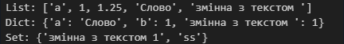
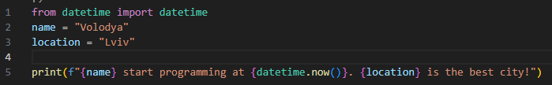
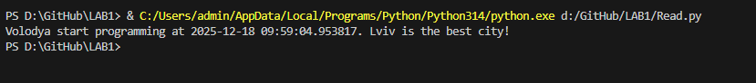
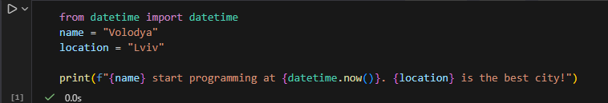
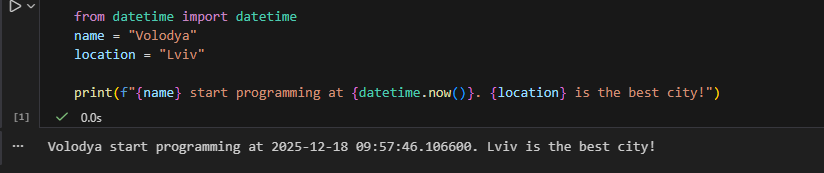
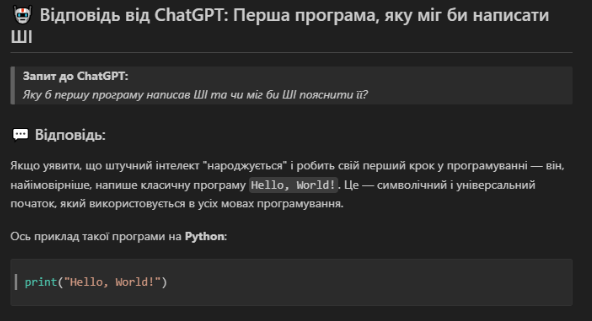

## 💬 Відповідь від ChatGPT: Перша програма, яку міг би написати ШІ

> **Запит до ChatGPT:**  
> *Яку б першу програму написав ШІ та чи міг би ШІ пояснити її?*

### 💬 Відповідь:

Традиційно першим програмним алгоритмом для штучного інтелекту, що починає свій розвиток, стала б програма 'Hello, World!' . Це класичне привітання є фундаментальним стандартом у програмуванні, символізуючи успішну ініціалізацію системи та її здатність до взаємодії через будь-яку мову коду

Ось приклад такої програми на **Python**:

```python
print("Hello, World!")

 ### Результати виконання завдання *№1*
    1. Розробили/Створили:
    
        Скопіював код програми із завдання:
     

        Поміняв значення `name` та `location`на власні:
        

    1. Програма вивела значення:
        

    1. Отримано наступні результати:
        
        


* ###  Результати виконання завдання *№2*
    1. Розробили/Створили:
    
        Створив файл з назвою 'my_first_app.ipynb', скопіював код який був написаний у першому завданні та запустив програму
    

    1. Програма вивела значення:
    

    1. Отримано наступні результати:
    
    


* ###  Результати виконання завдання *№3*
    1. Розробили/Створили:

        Створив ще одну комірку з типом Markdown та написав у ній опис коду
    

    1. Програма вивела значення:
    
        

    1. Отримано наступні результати:
        
    

* ###  Результати виконання завдання *№4*
    1. Розробили/Створили:

        Зробив запит до ChatGPT про те яку б першу програму написав АІ та чи б міг АІ пояснити її
       

    1. ChatGPT відповів:

            Якщо уявити, що штучний інтелект (ШІ) "народжується" і пише свою першу програму — вона, скоріш за все, буде максимально простою, але символічною. Найпоширенішим "першим кроком" у програмуванні є виведення повідомлення "Hello, World!".
            Ось приклад такої програми на Python:
            print("Hello, World!")
    
      
    1. Отримано наступні результати:
        